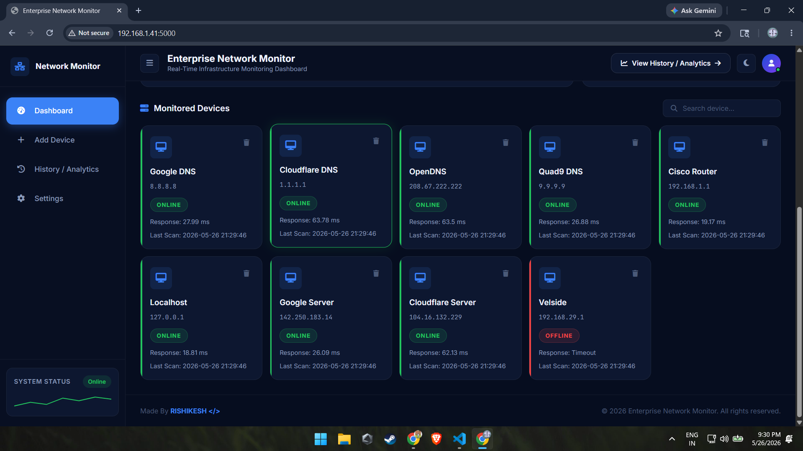

# 🚀 Enterprise Network Monitor

A modern real-time network infrastructure monitoring dashboard built using **Python, Flask, SQLite, Socket.IO, HTML/CSS/JS**.

This system continuously monitors devices using ICMP ping requests and provides:

- Real-time device health monitoring
- Live analytics dashboard
- Historical monitoring logs
- Online/offline tracking
- Response time analytics
- Professional enterprise UI
- SQLite log storage
- Real-time websocket updates

---

## 📸 Application Screenshots

## 🖥 Dashboard


---

## 📊 Analytics Page


---

## 🌐 Device Monitoring


---

# ✨ Features

## ✅ Real-Time Monitoring

- Continuous device monitoring
- Auto-refreshing dashboard
- Live online/offline status
- Response latency tracking

---

## ✅ Enterprise Dashboard UI

- Professional dark theme
- Responsive sidebar layout
- Analytics cards
- Modern device cards
- Search functionality
- Animated UI elements

---

## ✅ Historical Analytics

- SQLite database logging
- Monitoring history table
- Search & filtering
- Timestamp tracking
- Status tracking

---

## ✅ Device Management

- Add new devices
- Delete devices
- JSON-based configuration
- Live updates

---

# 🛠️ Tech Stack

| Technology | Usage |
|---|---|
| Python | Backend Logic |
| Flask | Web Framework |
| Flask-SocketIO | Real-Time Updates |
| SQLite | Database |
| HTML5 | Frontend Structure |
| CSS3 | Styling |
| JavaScript | Frontend Logic |
| Font Awesome | Icons |

---

# 📂 Project Structure

```bash
Network-Monitor/
│
├── app.py
├── database.py
├── devices.json
├── requirements.txt
├── README.md
├── network_monitor.db
│
├── static/
│   ├── style.css
│   └── dashboard.js
│
├── templates/
│   ├── dashboard.html
│   └── analytics.html
│
├── screenshots/
│   ├── dashboard-main.png
│   ├── devices-section.png
│   └── analytics-page.png
│
└── logs/
```

---

# ⚙️ Installation

## 1️⃣ Clone Repository

```bash
git clone https://github.com/YOUR_USERNAME/Network-Monitor.git
```

---

## 2️⃣ Open Project

```bash
cd Network-Monitor
```

---

## 3️⃣ Create Virtual Environment

### Windows

```bash
python -m venv venv
venv\Scripts\activate
```

### Linux / Mac

```bash
python3 -m venv venv
source venv/bin/activate
```

---

## 4️⃣ Install Dependencies

```bash
pip install -r requirements.txt
```

---

## 5️⃣ Run Application

```bash
python app.py
```

---

# 🌐 Access Application

Open browser:

```bash
http://127.0.0.1:5000
```

---

# 📡 Example Monitored Devices

```json
[
    {
        "name": "Google DNS",
        "ip": "8.8.8.8"
    },
    {
        "name": "Cloudflare DNS",
        "ip": "1.1.1.1"
    }
]
```

---

# 🧠 How It Works

1. Devices are loaded from `devices.json`
2. Python backend pings devices periodically
3. Results are stored in SQLite database
4. Flask-SocketIO pushes live updates
5. Dashboard updates automatically in browser

---

# 📈 Upcoming Features

## 🔥 Planned Upgrades

- [ ] Pie charts & graphs
- [ ] Live websocket charts
- [ ] User authentication system
- [ ] Device grouping
- [ ] Email alerts
- [ ] Telegram/Discord alerts
- [ ] Export reports (PDF/CSV)
- [ ] Device uptime analytics
- [ ] Docker deployment
- [ ] Linux server deployment
- [ ] REST API support
- [ ] Role-based admin panel
- [ ] AI anomaly detection
- [ ] Cloud deployment

---

# 🚀 Future Vision

This project is evolving into a full enterprise-grade infrastructure monitoring system similar to:

- Zabbix
- PRTG
- Uptime Kuma
- Nagios

---

# 👨‍💻 Author

## RISHIKESH </>

- Full Stack Developer
- Python Developer
- AI + Network Systems Enthusiast
🚀 Open to:
- Collaborations
- Freelance Projects
- Full Stack Development
- Python Development
- AI & Automation Projects
📧 Email: itsrishikeshonly@gmail.com
💻 GitHub: https://github.com/RISHIKESH2737
---

# 📄 License

This project is licensed under the MIT License.

---

# ⭐ Support

If you like this project:

- Star the repository ⭐
- Fork the project 🍴
- Share feedback 🚀