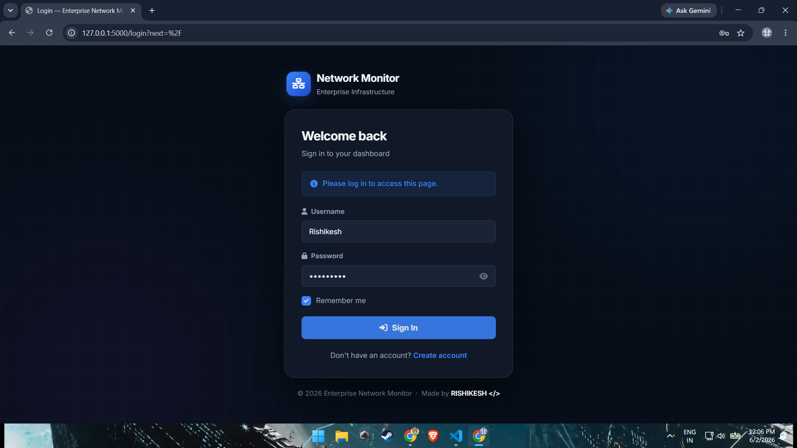
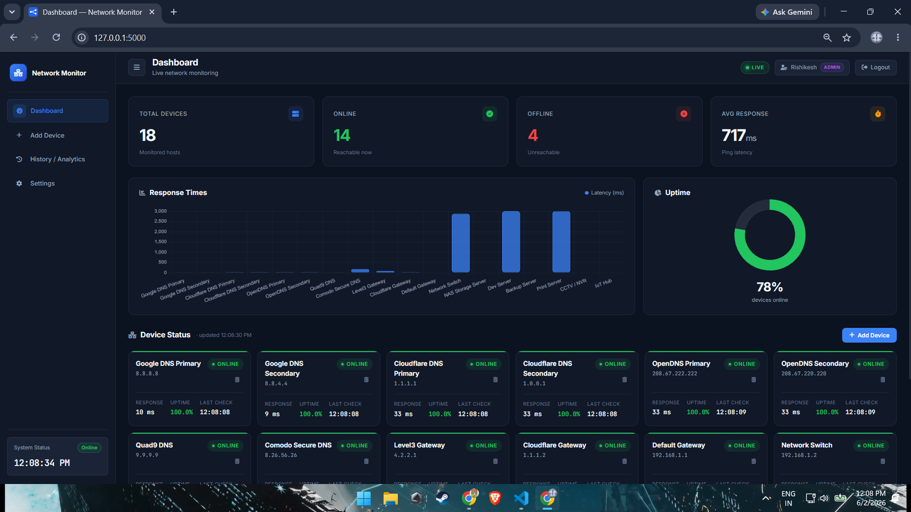
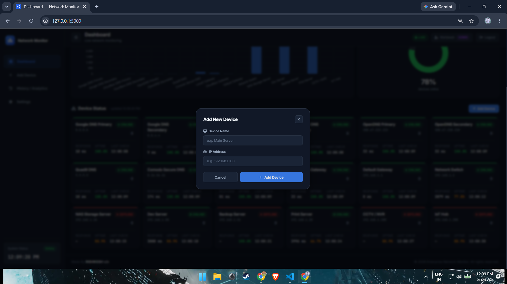
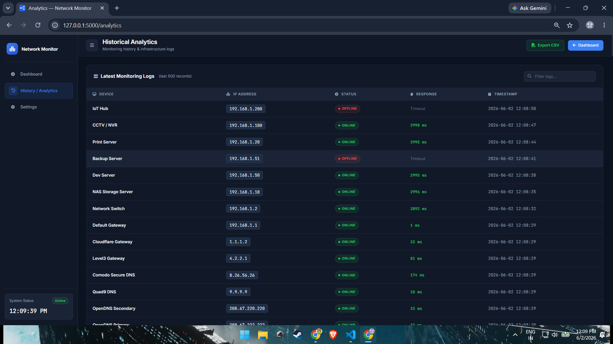
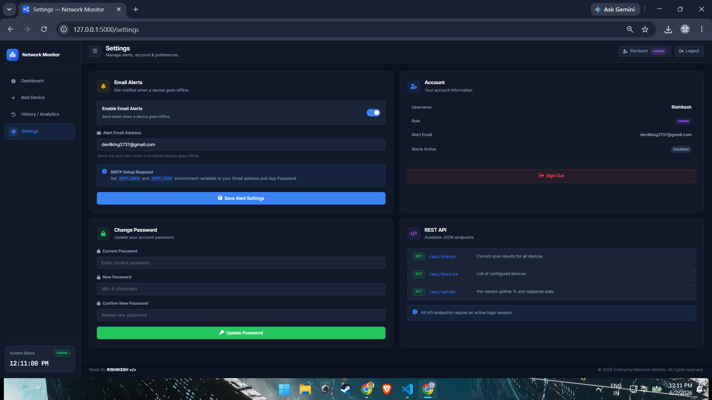

# Enterprise Network Monitor

A professional real-time network infrastructure monitoring dashboard built with **Python, Flask, SocketIO, SQLite, and vanilla JS**.

Continuously monitors devices via ICMP ping, logs history to a database, and pushes live updates to the browser — no manual refresh needed.

---

## Screenshots

## Login System



Secure authentication with role-based access control.

---

## Live Monitoring Dashboard



Real-time device monitoring with WebSocket updates.

---

## Device Management



Add and manage network devices directly from the UI.

---

## Historical Analytics



Searchable monitoring history with uptime statistics.

---

## Settings



Account management and alert configuration.

---

## Features

### Real-Time Monitoring
- Background scanner pings all devices every 60 seconds
- Live dashboard updates via WebSocket — no page refresh needed
- Per-device online/offline status with animated indicators
- Response latency tracking and average calculation

### Professional Dashboard UI
- Dark enterprise theme with CSS variables
- Collapsible sidebar with live clock
- Stat cards — total, online, offline, avg response
- Device cards with uptime percentage
- Bar chart (response times) and donut chart (uptime ratio)
- Add and delete devices from the UI

### Historical Analytics
- All ping results saved to SQLite via `PingLog` model
- Searchable/filterable log table (last 500 records)
- One-click CSV export with timestamped filename

### Device Management
- Add devices via modal form
- Delete devices with confirmation
- Devices persisted in `devices.json`
- Supports 15–20+ devices cleanly

### Authentication
- Login / Register with hashed passwords (Werkzeug)
- Role-based access: Admin and Viewer
- First registered user automatically becomes Admin
- Remember me session support

### Settings
- Enable/disable email alerts per user
- Change password form
- REST API reference panel

### REST API
All endpoints require an active session.

| Method | Endpoint | Description |
| ------ | -------- | ----------- |
| GET | `/api/status` | Live scan results for all devices |
| GET | `/api/devices` | List of configured devices |
| GET | `/api/uptime` | Per-device uptime % and online status |

---

## Tech Stack

| Technology | Purpose |
| ---------- | ------- |
| Python 3 | Backend logic |
| Flask | Web framework |
| Flask-SocketIO | Real-time WebSocket updates |
| Flask-Login | Authentication & session management |
| Flask-SQLAlchemy | ORM and database abstraction |
| SQLite | Persistent log storage |
| HTML5 / CSS3 | Frontend structure and styling |
| JavaScript (ES5+) | Frontend logic and SocketIO client |
| Chart.js | Bar and donut charts |
| Font Awesome 6 | Icons |

---

## Project Structure

```
Network-Monitor/
│
├── app.py                     ← Flask app factory + SocketIO init
├── scanner.py                 ← Background ping thread (60s interval)
├── devices.json               ← Persisted device list
├── requirements.txt
├── README.md
├── network_monitor.db         ← Auto-created on first run
│
├── auth/
│   ├── __init__.py
│   ├── models.py              ← User model
│   └── routes.py              ← /login  /register  /logout
│
├── dashboard/
│   ├── __init__.py
│   ├── routes.py              ← /  /add_device  /delete_device  /analytics  /api/*
│   └── monitor.py             ← ping_device()  load_devices()  save_devices()
│
├── settings/
│   ├── __init__.py
│   └── routes.py              ← /settings  (GET + POST)
│
├── database/
│   ├── __init__.py
│   ├── db.py                  ← SQLAlchemy instance + init_db()
│   └── models.py              ← User + PingLog models
│
├── static/
│   ├── style.css
│   └── favicon.svg
│
├── templates/
│   ├── base.html
│   ├── index.html             ← Dashboard
│   ├── analytics.html
│   ├── settings.html
│   ├── login.html
│   └── register.html
│
└── screenshots/
    ├── dashboard.png
    ├── analytics.png
    └── settings.png
```

---

## Installation

### 1. Clone the repository

```bash
git clone https://github.com/RISHIKESH2737/Network-Monitor.git
cd Network-Monitor
```

### 2. Create a virtual environment

**Windows**

```bash
python -m venv venv
venv\Scripts\activate
```

**Linux / macOS**

```bash
python3 -m venv venv
source venv/bin/activate
```

### 3. Install dependencies

```bash
pip install -r requirements.txt
```

### 4. Run the application

```bash
python app.py
```

### 5. Open in browser

```
http://127.0.0.1:5000
```

Register the first account — it will automatically be assigned the **Admin** role.

---

## Configuration

### Devices

Edit `devices.json` in the project root to pre-configure devices:

```json
[
  { "name": "Google DNS Primary",     "ip": "8.8.8.8" },
  { "name": "Cloudflare DNS Primary", "ip": "1.1.1.1" },
  { "name": "Default Gateway",        "ip": "192.168.1.1" }
]
```

Devices can also be added and removed directly from the dashboard UI.

### Email Alerts

Set these environment variables before running:

```bash
export SMTP_USER="your@gmail.com"
export SMTP_PASS="your-app-password"
```

Then enable alerts in **Settings → Email Alerts**. Requires Gmail 2FA and an App Password.

### Secret Key

For production, set a fixed secret key so sessions survive restarts:

```bash
export SECRET_KEY="your-long-random-string"
```

---

## How It Works

1. `devices.json` is loaded on startup
2. `scanner.py` starts a background thread that pings every device every 60 seconds
3. Each result is saved to the `PingLog` SQLite table
4. Flask-SocketIO broadcasts a `scan_update` event to all connected browsers
5. The dashboard JS receives the event and updates cards + charts in-place — no page reload, no flicker

---

## Requirements

```
Flask
Flask-Login
Flask-SocketIO
Flask-SQLAlchemy
Werkzeug
python-dotenv
eventlet
```

Full pinned versions in `requirements.txt`.

---

## Roadmap

- [ ] Email alerts when device goes offline
- [ ] Telegram / Discord webhook alerts
- [ ] Device grouping (e.g. DNS Servers, Local Network)
- [ ] Per-device uptime history charts
- [ ] PDF report export
- [ ] Docker deployment
- [ ] AI anomaly detection for unusual latency spikes
- [ ] SNMP support for managed switches and routers

---

## Author

**RISHIKESH \</>**

Full Stack Developer · Python Developer · AI + Network Systems Enthusiast

- 📧 Email: [itsrishikeshonly@gmail.com](mailto:itsrishikeshonly@gmail.com)
- 💻 GitHub: [github.com/RISHIKESH2737](https://github.com/RISHIKESH2737)

Open to collaborations, freelance projects, and full stack / Python / AI automation work.

---

## License

This project is licensed under the [MIT License](LICENSE).

---

## Support

If you find this project useful, please consider giving it a ⭐ on GitHub — it helps others discover it.